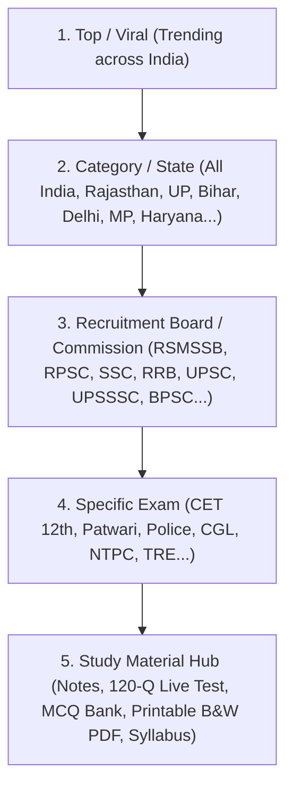

# 🏛️ संपूर्ण भारत एवं राज्य स्तरीय परीक्षा पदानुक्रम मास्टर डायरेक्टरी (2026)

यह दस्तावेज़ 'सरकारी साथी' पोर्टल हेतु तैयार किए गए **5-स्तरीय परीक्षा पदानुक्रम (5-Level Taxonomy Architecture)** का संपूर्ण आधिकारिक विवरण है।

---

## 🎯 मुख्य संरचना (5-Level Hierarchy)

---

## 📊 डायरेक्टरी सांख्यिकी (Directory Summary)
- **कुल श्रेणियां (Major Categories):** 3
- **शामिल राज्य एवं समूह:** 12
- **शामिल अधिकृत भर्ती बोर्ड/आयोग:** 28
- **सत्यापित वास्तविक परीक्षाएं:** 85+

---

## 1. 🔥 शीर्ष एवं सर्वाधिक लोकप्रिय परीक्षाएं (Top / Viral Section)
वेबसाइट के होमपेज पर छात्रों को सीधे सबसे चर्चित व ट्रेंडिंग परीक्षाओं तक पहुँचाने के लिए 15 प्रमुख परीक्षाओं का क्विक-एक्सेस:
1. **राजस्थान CET (12वीं स्तर) 2026** (RSMSSB) — *100% सिलेबस पूर्ण • 10 इकाइयां नोट्स, 1200 MCQs व B&W प्रिंट पेपर लाइव*
2. **SSC CGL 2026** (SSC) — *30+ लाख छात्र • Inspector, ASO, Tax Assistant*
3. **रेलवे RRB NTPC 2026** (RRB) — *स्टेशन मास्टर, गुड्स गार्ड, सीनियर क्लर्क*
4. **रेलवे ग्रुप D (Level-1)** (RRB) — *1 लाख+ संभावित पद • 10वीं पास*
5. **UP पुलिस कांस्टेबल 2026** (UPPBPB) — *60,000+ सिपाही भर्ती*
6. **SSC GD कांस्टेबल 2026-27** (SSC) — *40,000+ अर्धसैनिक बल (BSF, CISF, CRPF)*
7. **राजस्थान पटवारी भर्ती 2026** (RSMSSB) — *3000+ पद • CET आधारित*
8. **बिहार BPSC शिक्षक भर्ती (TRE)** (BPSC) — *लाखों प्राथमिक, TGT व PGT पद*
9. **रेलवे ALP एवं तकनीशियन 2026** (RRB) — *सहायक लोको पायलट व ITI ट्रेड्स*
10. **DSSSB दिल्ली शिक्षक व क्लर्क 2026** (DSSSB) — *PRT, TGT, PGT व DASS*
11. **UPSSSC PET 2026** (UPSSSC) — *समूह ग भर्तियों का 25+ लाख छात्रों का गेटवे*
12. **बिहार पुलिस सिपाही भर्ती** (CSBC) — *21,391 कांस्टेबल पद*
13. **SSC CHSL (10+2)** (SSC) — *LDC, JSA, DEO पद*
14. **राजस्थान पुलिस कांस्टेबल 2026** (Raj Police) — *6000+ कांस्टेबल पद*
15. **UPSC सिविल सेवा (IAS/IPS) 2026** (UPSC) — *देश की सर्वोच्च परीक्षा*

---

## 2. 🏛️ विस्तृत राज्य एवं बोर्डवार पदानुक्रम (Complete Classification)

### A. अखिल भारतीय / राष्ट्रीय स्तर (All India / National)
- **SSC (Staff Selection Commission):** CGL, CHSL, GD कांस्टेबल, MTS, CPO SI
- **RRB (Railway Recruitment Boards):** NTPC (ग्रेजुएट व 12th), Group D, ALP, Technician, RPF Constable & SI
- **UPSC (Union Public Service Commission):** सिविल सेवा (IAS/IPS), NDA & NA, CDS, CAPF (AC)
- **Banking (IBPS / SBI):** SBI PO/Clerk, IBPS PO/Clerk, IBPS RRB ग्रामीण बैंक
- **Defence (Armed Forces):** Army Agniveer GD, Air Force Agniveer Vayu, Navy Agniveer

### B. राजस्थान (Home & Master State)
- **RSMSSB (राजस्थान कर्मचारी चयन बोर्ड):**
  - **राजस्थान CET (12वीं स्तर) 2026** *(हमारा पूर्ण तैयार मॉडल: 10 इकाइयां नोट्स, 120 प्रश्नों के 10 टेस्ट, 10 B&W प्रिंट पीडीएफ)*
  - **राजस्थान CET (स्नातक स्तर) 2026**
  - **राजस्थान पटवारी भर्ती**
  - **कनिष्ठ सहायक / LDC भर्ती**
  - **पशु परिचर सीधी भर्ती**
- **RPSC (राजस्थान लोक सेवा आयोग):**
  - RAS / RTS (राजस्थान प्रशासनिक सेवा)
  - स्कूल व्याख्याता (1st Grade Teacher)
  - वरिष्ठ अध्यापक (2nd Grade Teacher)
  - पुलिस उपनिरीक्षक (Sub-Inspector - SI)
- **राजस्थान पुलिस भर्ती प्रकोष्ठ:**
  - पुलिस कांस्टेबल (सामान्य ड्यूटी / चालक / RAC / दूरसंचार)
- **राजस्थान उच्च न्यायालय (RHC):**
  - जूनियर ज्यूडिशियल असिस्टेंट (JJA) / क्लर्क ग्रेड-II

### C. उत्तर प्रदेश (Uttar Pradesh)
- **UPPBPB (पुलिस भर्ती बोर्ड):** UP पुलिस कांस्टेबल, UP दरोगा (SI)
- **UPSSSC (अधीनस्थ सेवा चयन आयोग):** PET, राजस्व लेखपाल, ग्राम विकास अधिकारी (VDO)
- **UPPSC (लोक सेवा आयोग):** सम्मिलित राज्य प्रवर अधीनस्थ सेवा (PCS), RO / ARO

### D. बिहार (Bihar)
- **BPSC (बिहार लोक सेवा आयोग):** शिक्षक भर्ती (TRE), 70वीं/71वीं CCE
- **BSSC (बिहार कर्मचारी चयन आयोग):** द्वितीय इंटर स्तरीय (10+2), तृतीय स्नातक स्तरीय (CGL)
- **CSBC / BPSSC (पुलिस भर्ती पर्षद):** बिहार पुलिस सिपाही (21,391 पद), बिहार दारोगा (SI)

### E. दिल्ली (NCT of Delhi)
- **DSSSB (दिल्ली अधीनस्थ सेवा चयन बोर्ड):** PRT/TGT/PGT शिक्षक, कनिष्ठ सहायक (LDC), DASS Grade-II
- **दिल्ली पुलिस भर्ती:** कांस्टेबल (एग्जीक्यूटिव), हेड कांस्टेबल

### F. हरियाणा एवं मध्य प्रदेश
- **HSSC (हरियाणा):** CET Group C, CET Group D, हरियाणा पुलिस कांस्टेबल
- **MPESB (मध्य प्रदेश व्यापम):** MP पुलिस आरक्षक, MP पटवारी, वनरक्षक व जेल प्रहरी

---

## 3. 📚 स्तर 5: परीक्षा अध्ययन सामग्री ब्लूप्रिंट (Material Blueprint)

प्रत्येक परीक्षा के अंतर्गत छात्र को 5 सुव्यवस्थित संसाधन प्राप्त होंगे:
1. 📘 **क्लास नोट्स (Class Notes):** 100% सिलेबस-कवर्ड, रंगीन व देवनागरी शुद्ध।
2. 🎯 **ऑनलाइन लाइव मॉक टेस्ट (Live Mock Test):** वास्तविक परीक्षा इंटरफेस (120 प्रश्न, 120 मिनट, 5वां OMR विकल्प, नेगेटिव मार्किंग, तुरंत स्कोरकार्ड)।
3. 📄 **वस्तुनिष्ठ प्रश्न बैंक (MCQ Bank):** प्रत्येक टॉपिक के उच्च-स्तरीय अभ्यास प्रश्न एवं विस्तृत हल।
4. 🖨️ **ऑफलाइन प्रिंट पेपर (B&W PDF):** लेजर/ज़ेरॉक्स प्रिंट फ्रेंडली, परीक्षार्थी विवरण बॉक्स एवं अंत में 6-कॉलम अधिकृत उत्तरमाला।
5. 📑 **सिलेबस एवं पुराने पेपर (Official Syllabus & PYQs):** आधिकारिक सिलेबस और पिछले 5 वर्षों के हल प्रश्नपत्र।

---

## 4. एडमिन पैनल में उपयोग का तरीका (Admin Integration Guide)
- `MASTER_EXAM_HIERARCHY_DATA.json` फ़ाइल सीधे एडमिन पैनल के **"Bulk Import"** में अपलोड की जा सकेगी।
- प्रत्येक राज्य, बोर्ड और परीक्षा का `is_active` फ्लैग सीधे एडमिन पैनल से टॉगल (On/Off) किया जा सकेगा।
