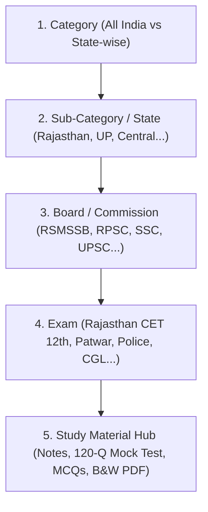

# 🏛️ सरकारी साथी — मास्टर आर्किटेक्चर एवं डेवलपमेंट प्लान (2026)

यह दस्तावेज़ वेबसाइट को पूरी तरह डेटा-ड्रिवन (Data-Driven), सुपर-फास्ट, और एडमिन पैनल से 100% कस्टमाइज़ेबल बनाने का आधिकारिक रोडमैप है।

---

## 🎯 1. मुख्य विज़न: 5-स्तरीय पदानुक्रम (5-Level Hierarchy)

छात्रों को बिना किसी भटकाव के सीधे उनकी परीक्षा तक पहुँचाने के लिए 5-स्तरीय सुव्यवस्थित संरचना:

### स्तरवार विवरण:
1. **Level 1: Category (मुख्य श्रेणी):**
   - राष्ट्रीय स्तर (All India / Central Govt Exams)
   - राज्य स्तरीय भर्तियां (State-wise Exams: राजस्थान, उत्तर प्रदेश, बिहार आदि)
2. **Level 2: Sub-Category / राज्य या संवर्ग:**
   - यदि राज्य चुना ➡️ राजस्थान, उत्तर प्रदेश, मध्य प्रदेश आदि।
   - यदि All India चुना ➡️ Central Government, Banking, Defence, Railways आदि।
3. **Level 3: Board / भर्ती आयोग:**
   - राजस्थान में ➡️ **RSMSSB** (कर्मचारी चयन बोर्ड), **RPSC** (लोक सेवा आयोग), **Rajasthan Police**, **High Court**।
   - All India में ➡️ **SSC**, **UPSC**, **NTA**, **RRB**।
4. **Level 4: Exam (विशिष्ट परीक्षा):**
   - जैसे RSMSSB के अंतर्गत ➡️ **राजस्थान CET (12वीं स्तर)**, **CET (Graduate)**, **पटवारी**, **VDO**, **LDC**।
5. **Level 5: Study Material Hub (परीक्षा सामग्री):**
   - परीक्षा कार्ड पर क्लिक करते ही 4 स्पष्ट विकल्प:
     - 📘 **क्लास नोट्स (Class Notes)** — 100% पाठ्यक्रम सटीक, टू-द-पॉइंट
     - 🎯 **ऑनलाइन लाइव मॉक टेस्ट (Live Mock Test)** — 120 प्रश्न, 120 मिनट टाइमर, 5-ऑप्शन OMR प्रारूप
     - 📄 **वस्तुनिष्ठ प्रश्न बैंक (MCQ Bank)** — अभ्यास हेतु विस्तृत व्याख्या सहित
     - 🖨️ **ऑफलाइन प्रिंट पेपर (B&W PDF)** — लेजर/ज़ेरॉक्स प्रिंट अनुकूल, अंत में 6-कॉलम उत्तरमाला
     - 📑 **सिलेबस व पिछले साल के पेपर (Official Syllabus & PYQs)**

---

## 🧹 2. वेबसाइट क्लीन-अप एवं जीरो-फ्लिकर आर्किटेक्चर (Clean Slate)

- ✅ **डमी डेटा का पूर्ण निष्कासन:** 518 डमी कैटेगरीज और 6,527 डमी एग्ज़ाम्स को हटाकर सुरक्षित बैकअप (`data/backup_dummy_data/`) में सुरक्षित कर दिया गया है।
- ✅ **वेबसाइट खाली व तेज़:** अब वेबसाइट पर कोई टूटा हुआ लोगो या फर्जी एग्ज़ाम नहीं दिखेगा।
- ✅ **शून्य लेआउट शिफ्ट (Zero Layout Shift):** डेटा लोड होने के दौरान केवल स्मूथ 'Shimmer Skeleton Loader' दिखेगा, कोई हार्डकोडेड डेटा नहीं चमकेगा।
- ✅ **सर्वर-साइड रेंडरिंग (SSR / Cached Fetch):** डेटाबेस से डेटा सीधा सर्वर पर लोड होगा जिससे गूगल Core Web Vitals स्कोर 95+ रहेगा।

---

## ⚙️ 3. एडमिन पैनल नियंत्रण एवं कस्टमाइजेशन (100% Admin Control)

वेबसाइट को कोड में छुए बिना एडमिन पैनल से पूर्णतया संचालित करने की प्रणाली:

### A. 1-क्लिक मास्टर JSON अपलोड (Bulk Import System)
- एडमिन पैनल में `📥 Master JSON Import` बटन।
- एक ही JSON फ़ाइल से नए राज्य, बोर्ड, परीक्षाएं और उनके नोट्स/पीडीएफ लिंक्स 1 सेकंड में अपलोड।

### B. डायनामिक विजिबिलिटी नियंत्रण (Visibility Toggles)
प्रत्येक एग्ज़ाम व मटेरियल के सामने ऑन/ऑफ स्विच:
- `is_active` (वेबसाइट पर दिखाना है या छुपाना है)
- `show_in_featured` (होमपेज फीचर्ड में रखें या नहीं)
- `show_live_test` (लाइव टेस्ट सक्रिय करें या नहीं)
- `show_printable_pdf` (B&W पीडीएफ डाउनलोड उपलब्ध कराएं या नहीं)

### C. SEO एवं मेटा टैग्स प्रबंधन (Dynamic SEO per Exam)
एडमिन पैनल में प्रत्येक परीक्षा और कैटेगरी के लिए समर्पित SEO इनपुट:
- **Meta Title** (सर्च इंजन में दिखने वाला सटीक शीर्षक - Max 60 Chars)
- **Meta Description** (गूगल सर्च रिजल्ट में नीचे दिखने वाला विवरण - Max 160 Chars)
- **Meta Keywords** (प्रमुख खोज कीवर्ड्स)
- **OG Image URL** (व्हाट्सएप/फेसबुक पर शेयर करने पर दिखने वाला बैनर)
- **Canonical URL** (सर्च इंजन रैंकिंग इंडेक्सिंग हेतु)

---

## 📋 4. कार्यान्वयन रोडमैप (Next Execution Steps)

1. **कदम 1 (पूर्ण ✅):** डमी डेटा हटाकर वेबसाइट को क्लीन करना व प्लान को सुव्यवस्थित करना।
2. **कदम 2:** 5-स्तरीय पदानुक्रम (Category ➡️ State ➡️ Board ➡️ Exam ➡️ Material) का डेटाबेस/स्टोर स्कीमा तय करना।
3. **कदम 3:** एडमिन पैनल में 'Master JSON Upload' और 'SEO Fields' जोड़ना।
4. **कदम 4:** तैयार राजस्थान CET (12th Level) की 10 इकाइयों (1200 MCQs, 10 B&W PDFs) को इस नए सिस्टम में पहली आधिकारिक परीक्षा के रूप में लाइव करना।
